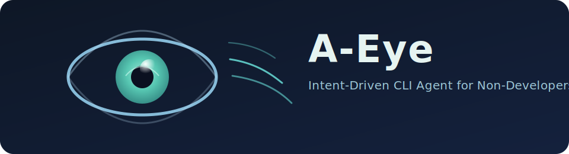

# A-Eye

<p align="center">
  
</p>

A-Eye is a CLI-first, intent-driven software development agent designed for non-developers.

It is the host product and user experience layer. Under the hood, A-Eye uses a deterministic orchestration model (i7) and engine components (DAO) to keep execution safe, auditable, and resumable.

Core workflow:

`Intent -> System Context -> Plan -> Explain -> Patch -> Verify -> Learn`

This repository is currently an A-Eye CLI fork used to build and validate A-Eye safely.

## Current Status

- A-Eye is available as a standalone CLI binary: `a-eye`.
- Legacy compatibility path (`codex a-eye`) still works during migration.
- Default mode is safe-first (Tier 1): planning and diff generation.
- Supervised execution is gated (Tier 2+) with explicit approval prompts.
- Structured artifacts are written under `.nlpg/runs/<run_id>/`.

## Quickstart (current fork)

From this repo:

```bash
cd codex-rs
cargo run -- setup
cargo run -- plan "describe your goal"
cargo run -- patch --from .nlpg/runs/<run_id>/plan.json
cargo run -- verify
```

Install `a-eye` to your local Cargo bin path:

```bash
cd codex-rs
cargo install --path cli --bin a-eye --locked
```

Or from repo root with presets:

```bash
just dev-fast    # faster local iteration build
just release-max # maximum release optimization
```

Then run:

```bash
a-eye setup
a-eye plan "describe your goal"
```

Run the TUI quickly from repo root:

```bash
just a-eye
```

## Deterministic Orchestration (i7 + DAO)

A-Eye uses the **i7 framework** and DAO-style deterministic orchestration principles:

- deterministic state transitions
- artifact-first workflow execution
- policy-gated approvals
- replay and resume support for interrupted runs

This makes A-Eye behavior inspectable and enterprise-auditable without changing the CLI-first experience.

## How A-Eye and DAO Relate

- **A-Eye** is the product users run (`a-eye`) and interact with via CLI/TUI.
- **i7** is the orchestration framework: Intent, Inspect, Interpret, Isolate, Implement, Verify, Integrate.
- **DAO** is the deterministic orchestration engine layer used to operationalize i7 concepts.

In short: A-Eye is the interface, i7 is the model, DAO is the execution engine.

## Architecture Docs

- i7 framework overview: `docs/i7-framework.md`
- i7 to DAO implementation mapping: `docs/i7-to-dao-mapping.md`

## Operational Guarantees

A-Eye and its orchestration layer are designed around:

- monotonic correlation IDs (`run_id`, `request_id`, `invocation_id`)
- deterministic approval and policy transitions
- append-only event history and snapshot-aware replay
- explicit resume semantics (no implicit unsafe continuation)

## Engine Commands (when DAO workspace is present)

If you also have the extracted DAO workspace checked out, you can run engine-level flows directly:

```bash
dao run --repo .
dao replay --last --repo .
dao resume --repo .
```

## Launch Focus

See the launch plan in `docs/a-eye-launch-plan.md`.
For internal package/module rebrand sequencing, see `docs/a-eye-internal-rename-plan.md`.

## Branding Direction

A-Eye now runs as a standalone binary (`a-eye`) while we continue internal extraction and cleanup.

## License

Apache-2.0 (see `LICENSE`).
