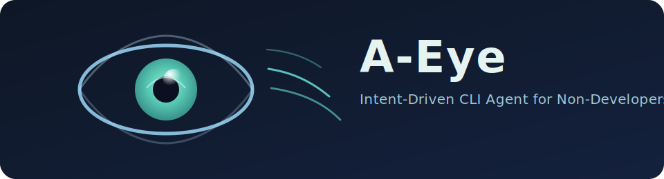

# A-Eye

<p align="center">
  
</p>

A-Eye is a CLI-first, intent-driven software development agent designed for non-developers.

Core workflow:

`Intent -> System Context -> Plan -> Explain -> Patch -> Verify -> Learn`

This repository is currently an A-Eye CLI fork used to build and validate A-Eye safely.

## Current Status

- A-Eye is available as a standalone CLI binary: `a-eye`.
- Legacy compatibility path (`codex a-eye`) still works during migration.
- Default mode is safe-first (Tier 1): planning and diff generation.
- Supervised execution is gated (Tier 2+) with explicit approval prompts.
- Structured artifacts are written under `.nlpg/runs/<run_id>/`.

## Quickstart (current fork)

From this repo:

```bash
cd codex-rs
cargo run -- scan
cargo run -- plan "describe your goal"
cargo run -- patch --from .nlpg/runs/<run_id>/plan.json
cargo run -- verify
```

Install `a-eye` to your local Cargo bin path:

```bash
cd codex-rs
cargo install --path cli --bin a-eye --locked
```

Then run:

```bash
a-eye scan
a-eye plan "describe your goal"
```

## Launch Focus

See the launch plan in `docs/a-eye-launch-plan.md`.
For internal package/module rebrand sequencing, see `docs/a-eye-internal-rename-plan.md`.

## Branding Direction

A-Eye now runs as a standalone binary (`a-eye`) while we continue internal extraction and cleanup.

## License

Apache-2.0 (see `LICENSE`).
